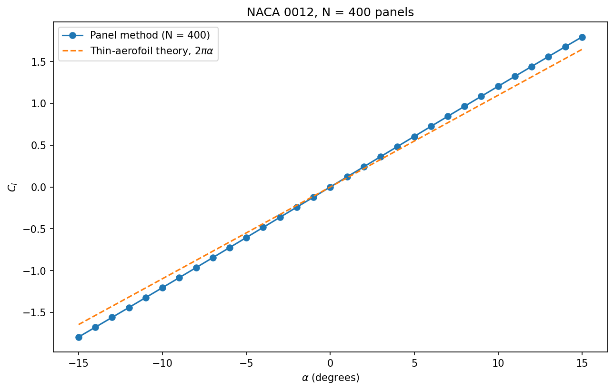
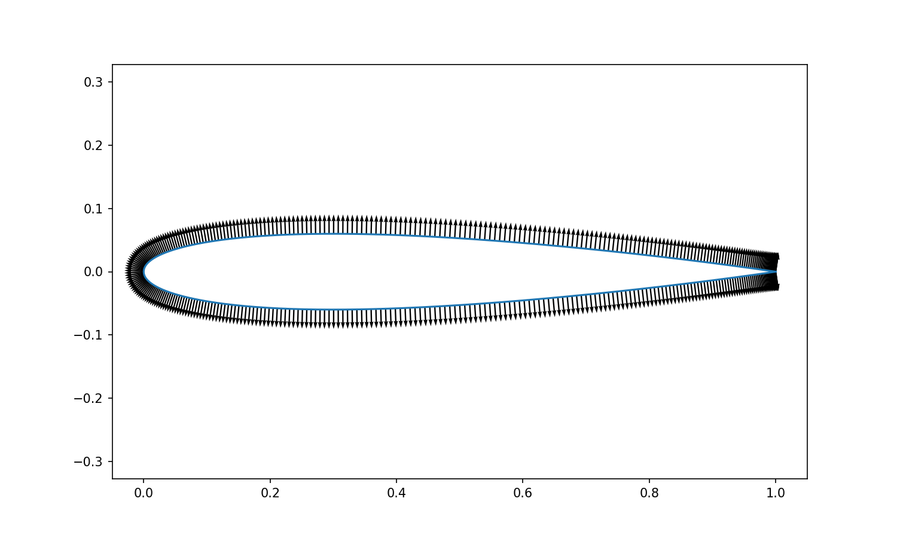

# 2D Hess–Smith Panel Method Airfoil Solver

This is a **2D Hess–Smith Panel Method Airfoil Solver** developed in C++. The solver can be used to analyse different airfoil shapes depending on the NACA numbers provided. For instance, the results shown below were obtained using the NACA 0012 airfoil. The plot shows the lift coefficient $C_l$ as a function of the angle of attack $\alpha$ of the incoming freestream, which is considered to have a constant velocity.



The NACA geometry is generated using the **cosine spacing method**, which depends on the number of points given to each half of the NACA surface. In this case, `n_per_surface = 200`, resulting in 399 geometry points and 398 panels.

## Method

The following physical assumptions are made for this idealised model:

* **Inviscid flow** — viscosity is neglected.
* **Incompressible flow** — density is treated as constant.
* **Irrotational flow** — vorticity is zero in the fluid domain, apart from idealised singularities and the circulation representation.
* **Steady flow** — the flow field is assumed not to change with time.
* **Two-dimensional flow** — the airfoil is treated as an infinitely long 2D cross-section.
* **Potential flow** — the velocity field can be described using a velocity potential.
* **No penetration through the airfoil surface** — the flow is tangent to the surface.
* **Kutta condition** — the circulation is determined so that the flow leaves the trailing edge in a physically reasonable way.

The airfoil surface is divided into panels, where each panel is a straight line connecting two consecutive geometry points. The source influence of each panel is calculated at the midpoint of the relevant panel, which acts as the control point where the flow tangency boundary condition is applied.



The solver uses a uniform source strength for each panel and a single constant vortex-sheet strength shared by the whole airfoil. The linearity of the potential-flow model allows the influence of each panel to be calculated independently and then combined through superposition.

For each control point $i$, the influence of every source panel $j$ is calculated. The resulting velocities are combined with the freestream and vortex-sheet contributions to enforce the no-penetration boundary condition.

The system consists of $N$ source-strength unknowns and one global vortex-sheet-strength unknown. The $N$ flow tangency equations are combined with an additional Kutta condition, giving a linear system of the form:

$$
A\mathbf{x}=\mathbf{b}
$$

The system is solved using **Gaussian elimination with partial pivoting**. The solution provides the source strengths and the vortex-sheet strength. The lift coefficient is then calculated from the circulation obtained from the vortex-sheet strength using the Kutta–Joukowski relationship.

## Validation

Several tests were implemented to check the geometry generation, panel influence calculations and the overall Hess–Smith solver.

### Symmetry test

The NACA 0012 airfoil was tested at zero angle of attack:

$$
\alpha=0
$$

Since the geometry is symmetric, the expected circulation and lift coefficient are zero. The calculated vortex-sheet strength was approximately zero, with the residual reaching the order of $10^{-17}$.

This test was used to check whether the solver preserves the expected symmetry of the airfoil at zero angle of attack.

### Net source strength

For a closed body, the total source strength should be **exactly zero for the continuous problem**:

$$
\sum_{j=1}^{N}\sigma_jL_j=0
$$

where $\sigma_j$ is the source strength of panel $j$ and $L_j$ is its length.

In the discrete numerical solution, however, this condition is satisfied only approximately. The remaining residual is a measure of the discretisation error, so it should decrease as the number of panels is increased.

The test was performed using different numbers of panels to investigate the convergence of the net source-strength residual. The convergence study was performed by manually varying `n_per_surface` between runs; these values are therefore not currently reproduced automatically by `validate.exe`.

The residuals obtained were:

| Points per surface | Net source strength |
| ------------------ | ------------------- |
| 50                 | $1.98\times10^{-3}$ |
| 100                | $9.7\times10^{-4}$  |
| 200                | $4.8\times10^{-4}$  |

The residual approximately halves when the number of points is doubled. This indicates first-order convergence of the net source-strength residual for the current implementation.

The test also helped identify a sign error that was not detected by the initial pointwise influence test. This showed the importance of testing the complete system and not only individual panel calculations.

### Lift-curve validation

The lift coefficient was calculated for different angles of attack and compared with the thin-airfoil-theory prediction:

$$
C_l=2\pi\alpha
$$

where $\alpha$ is expressed in radians.

The calculated lift-curve slopes for the tested airfoil thicknesses were:

| Maximum thickness | Calculated slope |
| ----------------- | ---------------- |
| 12%               | 6.895            |
| 6%                | 6.577            |
| 2%                | 6.366            |

The theoretical thin-airfoil slope is:

$$
2\pi\approx6.283
$$

The calculated slope approaches the thin-airfoil value as the airfoil thickness decreases. A finite-thickness airfoil displaces the surrounding flow and changes the velocity distribution around its surface.

These results provide a useful check of the numerical implementation and show how the airfoil thickness affects the calculated lift response in the current formulation.

## Limitations and discussion

The solver is based on an idealised potential-flow model, so its results should not be interpreted as a complete representation of real airfoil aerodynamics.

For the NACA 0012 case, the calculated lift-curve slope is approximately $6.895$ per radian, compared with the thin-airfoil-theory value of $2\pi\approx6.283$. This corresponds to a slope approximately 10% higher than the theoretical benchmark.

The thickness study shows that the calculated slope decreases as the airfoil thickness is reduced. A finite-thickness airfoil displaces the surrounding flow and changes the velocity distribution around the surface, which can increase the lift-curve slope relative to the idealised zero-thickness thin-airfoil model.

Experimental results for real NACA 0012 airfoils can produce a lift-curve slope of approximately $6.0$ per radian, depending on the Reynolds number, surface condition and experimental setup. This is below the thin-airfoil-theory value, whereas the current inviscid model produces a higher value. The difference is associated with the different physical assumptions: the Hess–Smith solver neglects viscosity, boundary-layer development and flow separation, while experimental measurements include these effects.

The solver therefore does not model:

* Boundary-layer development and skin-friction drag.
* Flow separation and stall.
* Viscous wake effects.
* Compressibility effects.
* Three-dimensional effects such as wingtip vortices and induced drag.

The purpose of this project is to investigate the physical and numerical principles behind the Hess–Smith panel method, including NACA geometry generation, panel discretisation, influence calculations, linear-system solution and the calculation and validation of aerodynamic quantities such as the lift coefficient.

## Build and run

The project can be built using the provided PowerShell build script:

```powershell
./build.ps1
```

The validation tests can then be run using:

```powershell
./validate.exe
```

The main solver can be run using:

```powershell
./main.exe
```


